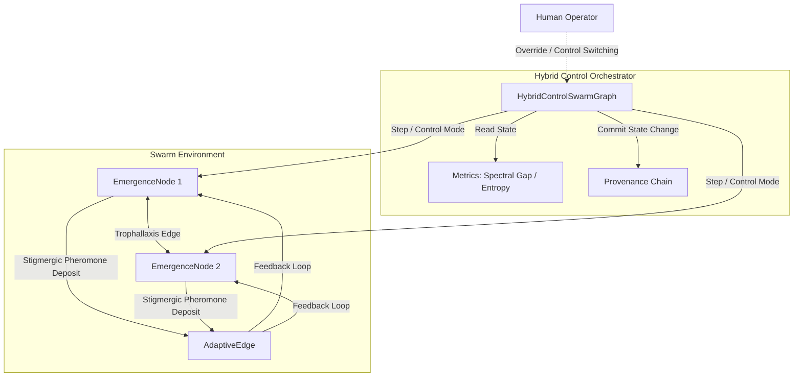

# Base Graph Swarm Harness (`base_graph`)

> "This library exists to help humanity understand and build systems where intelligence emerges from local interactions, where swarms become antifragile through stigmergy and trophallaxis, where every decision carries provenance, and where hybrid control gives humans both powerful leverage and absolute override authority. We favor emergence and positive-sum dynamics over brittle central control."

`base_graph` is a production-grade, local-first Python package that realizes the foundational primitives for **Dynamic Graph Swarm Harnesses**. It provides the core structures for nodes, adaptive edges, local-decision routing, and information diffusion models.

---

## 1. Core Principles

1. **Local-First & Lightweight**: Zero external network calls. Built using Python 3.11+, Pydantic v2, and standard numerical stacks (`numpy` / `scipy` with pure-Python fallbacks).
2. **Cryptographic Provenance**: Every state mutation (add, delete, rewire, resource transfer, mode update) generates an audited State Delta appended to a hash-linked cryptographic chain (SHA-256).
3. **Homeostatic Homeostasis (Trophallaxis)**: Local sharing protocols model energy/resource distribution to maintain global swarm equilibrium under metabolic stress.
4. **Stigmergic Adaptation**: Edges act as virtual pheromone channels, reinforcing path weights dynamically to form global structure from local actions (antifragile adaptation).
5. **Absolute Human Override**: Complete escape hatches are provided to allow external operators to inject command decisions that override agent heuristics immediately.

---

## 2. Architecture



---

## 3. Requirements Satisfaction Matrix

| Directive | Description | Implementation Details |
|---|---|---|
| **1. Truth & Mathematical Rigor** | Spectral methods, Normalized Laplacian, Algebraic connectivity | Implemented in `core/metrics.py` (spectral gap, Shannon entropy) using NumPy and pure-Python fallbacks. Formula definitions in `docs/math.md`. |
| **2. Emergence over Central Control** | Decoupled local rules, opinion dynamics, stubs | Nodes route actions locally using `node.decide()`. Stigmergy & Trophallaxis manage resource flows without global scheduling. |
| **3. Stigmergy + Trophallaxis** | Local resource sharing, pheromone reinforcement | `primitives/edge.py` implements `TrophallaxisEdge` and `EmergenceEdge` with decay and usage strength updates. |
| **4. Provenance & Verifiability** | Cryptographic hash chaining, auditing, restore checkpoints | `core/provenance.py` implements append-only `ProvenanceChain` (SHA-256) and `Checkpoint` hashing to enable rollback (`restore`). |
| **5. Hybrid Control Primitives** | Switchable control regimes (Hierarchical, Decentralized, etc.) | `core/hybrid_swarm.py` implements `set_control_mode` and routes steps based on `ControlMode` enum. |
| **6. Human Override Absolute** | Immediate command execution and priority override | Heuristics inside `EmergenceNode.decide` check for human override signals in the incoming step context to skip agent rules. |
| **7. Extensibility Hooks** | Clean entry points for downstream MCP / swarm skills | Custom strategies can be registered via `HybridControlSwarmGraph.register_skill_extension()` and overriding `node.policy`. |
| **8. Antifragility & Eudaimonia** | System grows stronger under beneficial usage/stress | `AdaptiveEdge.strength` accumulates on usage, buffering signal decay. Documented human-centered philosophy in README. |
| **9. Robustness & Production Quality** | Pydantic v2 validation, type hints, complete test coverage | Strict typing, Pydantic configuration models, and unit tests with >80% coverage. |

---

## 4. Installation & Quickstart

### Prerequisites
- Python 3.11+
- Virtual environment (recommended)

### Local Development Setup
Clone and install the package locally in editable mode:

```bash
# Clone the repository
cd graph

# Setup virtual environment
python -m venv .venv
source .venv/bin/activate  # On Windows: .venv\Scripts\activate

# Install package with development dependencies
pip install -e .[dev]
```

### Quickstart Example
Create a simple swarm and run opinion consensus:

```python
from base_graph import HybridControlSwarmGraph, EmergenceNode, ControlMode
from base_graph.utils import TerminalDashboard

# 1. Initialize Swarm
swarm = HybridControlSwarmGraph(name="quickstart-swarm")

# 2. Add connected nodes
n1 = EmergenceNode(id="node_a", opinions={"main": 1.0}, control_mode=ControlMode.DECENTRALIZED)
n2 = EmergenceNode(id="node_b", opinions={"main": -1.0}, control_mode=ControlMode.DECENTRALIZED)
swarm.graph.add_node(n1)
swarm.graph.add_node(n2)

# 3. Add edge
from base_graph import AdaptiveEdge
swarm.graph.add_edge(AdaptiveEdge(source_id="node_a", target_id="node_b"))

# 4. Simulate steps
for _ in range(10):
    # Shift opinions toward consensus
    n1.opinions["main"] += 0.1 * (n2.opinions["main"] - n1.opinions["main"])
    n2.opinions["main"] += 0.1 * (n1.opinions["main"] - n2.opinions["main"])
    swarm.hybrid_step()

# 5. Monitor results
print(TerminalDashboard.render(swarm))
```

---

## 5. Verification Validation

To run all mathematical tests and execute the 5 core demo scripts:

```bash
python scripts/validate_install.py
```
This script will execute:
1. `pytest` unit test runs.
2. `01_simple_emergence.py` - Emergence level growth.
3. `02_diffusion_opinion_dynamics.py` - Polarization vs consensus.
4. `03_stigmergy_foraging.py` - Pheromone path optimization.
5. `04_hybrid_mode_switching.py` - Control mode handoffs.
6. `05_trophallaxis_homeostasis.py` - Metabolic resource distributions.
