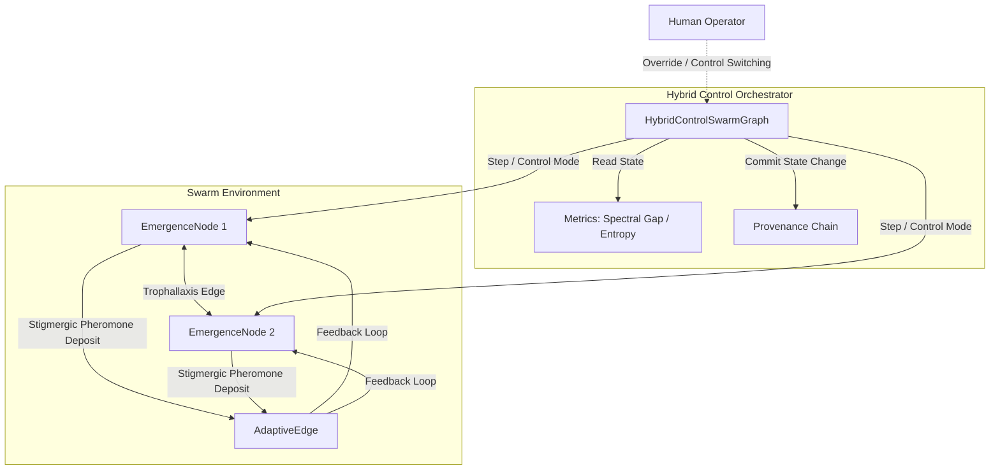

# Base Graph Architecture

This document describes the architectural design of `base_graph`, showing how local interactions map to global emergent behaviors under varying control structures.

---

## 1. Information & Resource Flow Diagram

---

## 2. Dynamic Control Modes

The swarm allows nodes to operate under different control regimes concurrently:

1. **Hierarchical**: Nodes propagate commands along directed trees. The root or intermediate parents make decisions, and children follow them.
2. **Decentralized**: Nodes execute consensus algorithms (opinion dynamics) to align state variables with neighbors.
3. **Stigmergic**: Nodes read and write to the environment (represented by edge weights/pheromones). Feedback reinforcement establishes path efficiency.
4. **Emergence**: Free-form local behavior, governed only by simple proximity rules and direct resource requirements.

---

## 3. Cryptographic Provenance Chain

To prevent non-deterministic failures and enable complete simulation repeatability:
- Every action/mutation updates the graph state.
- A **State Delta** is generated for each mutation.
- The `ProvenanceChain` hashes the state using SHA-256 in a blockchain-like structure:
  $$\text{Hash}_t = \text{SHA256}(\text{Hash}_{t-1} \parallel \text{Delta}_t)$$
- This structure enables absolute rollback capability (`restore()`) and cryptographic auditing.
